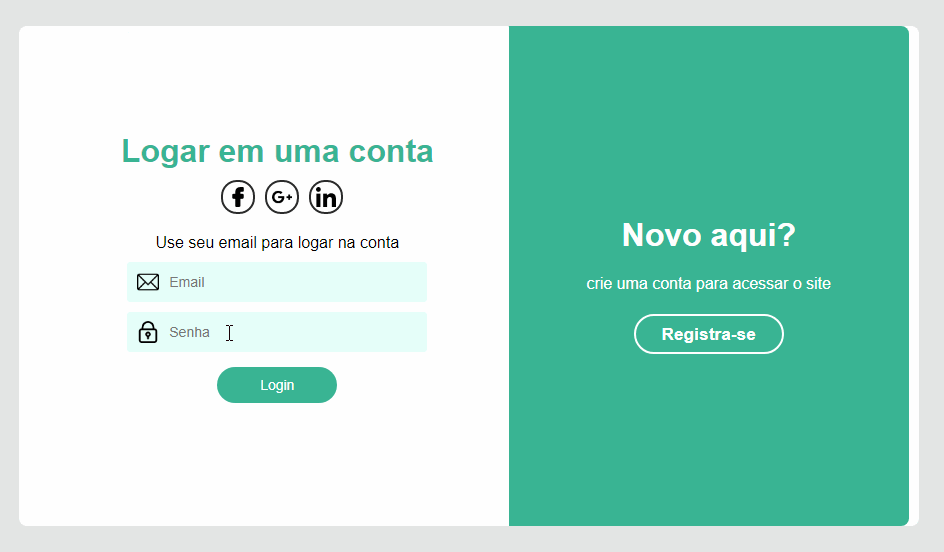

# Formaulario Animado :computer: :desktop_computer:

Um formulario feitopara estudos de animaçoes css, e ReactJs. O 
projeto conta apenas com o front-end da aplicação com layout fixo.

## layout

## Tecnologias

- typeScript :heavy_check_mark:
- ReactJs (front-end) :heavy_check_mark:
- Css (estilos) :heavy_check_mark:

## Como testar :thinking: :thinking:

Ao clonar o repositorio va para a pasta `` Formulario-Login-React `` e execute o camando `` npm install ``
ao finalizar execute `` npm start ``, e abra em seu navegador o `` http://localhost:3000 ``.

like :grin: :heart:
.
